# AI Trading Agent — Master Research Summary

**Project Repository Reference:** This document serves as the foundational research summary for the Autonomous AI Trading Agent project. All architectural decisions, research findings, and design principles documented herein are derived from the complete research conversation.

---

## 1. Executive Summary

### What We Are Building

We are designing an **industry-grade autonomous AI trading platform** that continuously scans financial markets, identifies attractive investment opportunities, analyzes them using quantitative models and AI reasoning, and executes trades through broker APIs—all within a rigorously controlled risk framework.

This is **not** a chatbot that tells users which stocks are good. It is a production system that:
- Operates autonomously with minimal human intervention
- Makes BUY/HOLD/SELL/NO-TRADE decisions based on evidence
- Manages position sizing, portfolio risk, and trade execution
- Maintains complete auditability of every decision

### What Makes This Different

Unlike typical stock-prediction systems or LLM trading demos, this platform is built on **three non-negotiable principles**:

1. **Deterministic risk override** – The risk engine always overrides AI decisions
2. **LLM gating** – LLMs are only invoked when necessary (cost control + hallucination reduction)
3. **Complete auditability** – Every decision is logged and reproducible

### Expected Capabilities

| Capability | Status |
|------------|--------|
| Market discovery and stock screening | ✅ Designed |
| Fundamental analysis (sector-normalized) | ✅ Designed |
| Technical analysis (limited indicators) | ✅ Designed |
| News and sentiment analysis | ✅ Designed (gated LLM) |
| Investment thesis generation | ✅ Designed (gated LLM) |
| BUY/HOLD/SELL/NO-TRADE decisions | ✅ Designed |
| Position sizing with hard caps | ✅ Designed |
| Portfolio-level risk management | ✅ Designed |
| Deterministic kill switch | ✅ Designed |
| Complete audit logging | ✅ Designed |
| Broker execution | ✅ Designed |
| Paper trading | ✅ Designed |
| Walk-forward backtesting | ✅ Designed |

---

## 2. Problem Statement

### Industry Problem

Financial markets generate massive volumes of real-time market, fundamental, news, and alternative data, making it difficult for investors to identify high-quality opportunities while reacting quickly to changing market conditions.

### Core Challenge

The core challenge is to build a **secure, explainable, regulation-aware, and risk-controlled autonomous trading infrastructure** that minimizes:

- Data errors and hallucinations
- Overfitting and look-ahead bias
- Execution failures and slippage
- Unnecessary trades and excessive risk
- Prompt injection and security breaches

### Why This Matters Now

The Alpha Arena experiment demonstrated that even frontier LLMs—ChatGPT, Gemini, Grok, Claude—lost 33-62% of capital in two weeks when given real trading autonomy. AlphaEdge Maestro lost **$1 million per minute** during a market shock. The evidence is clear: **current AI trading systems are not ready for autonomous deployment without rigorous safeguards**.

### SEBI Regulatory Context

SEBI circular **SEBI/HO/MIRSD/MIRSD-PoD/P/CIR/2025/0000013** (February 4, 2025) opened up API-based algorithmic trading for retail investors under a regulated framework. Key requirements include:

- Strategy registration if crossing OPS threshold
- Unique strategy ID for every order
- Broker hosting and monitoring
- Risk controls (position limits, kill switches) — **built in, not optional**
- Live-like testing before deployment
- 10 OPS threshold per exchange

---

## 3. Project Objectives

### Primary Objectives

| # | Objective | Description |
|---|-----------|-------------|
| 1 | **Automatic discovery** | Continuously scan thousands of stocks to find candidates |
| 2 | **Efficient analysis** | Analyze large numbers of stocks using tiered screening |
| 3 | **Multi-method analysis** | Combine quantitative models and AI reasoning |
| 4 | **Market regime detection** | Adapt strategy based on market conditions |
| 5 | **Structured theses** | Generate bull/bear cases with invalidation conditions |
| 6 | **Self-challenge** | Challenge its own decisions before acting |
| 7 | **Pre-trade risk calculation** | Calculate risk before trading |
| 8 | **Position sizing** | Optimize position size with hard caps |
| 9 | **Position monitoring** | Continuously monitor open positions |
| 10 | **Thesis deterioration detection** | Detect when investment thesis is no longer valid |
| 11 | **Exit decisions** | Generate sell signals with hierarchy |
| 12 | **Order validation** | Validate every order before execution |
| 13 | **Broker execution** | Execute trades through approved broker APIs |
| 14 | **Audit logging** | Maintain complete, immutable audit logs |
| 15 | **Anomaly detection** | Detect system anomalies automatically |
| 16 | **Safety limits** | Stop trading when safety limits are breached |

### MVP vs. Later Phases

| Phase | Scope |
|-------|-------|
| **MVP** | Data ingestion, screening, quantitative analysis, decision engine, risk engine, kill switch, audit logging, backtesting, paper trading |
| **V2** | LLM research agent (gated), news/sentiment, regime detection, broker integration, monitoring dashboard |
| **V3** | Controlled live trading, multi-asset support, champion/challenger learning, global expansion |

---

## 4. Autonomous Trading Agent Capabilities

### Market Discovery & Screening

- Scan US stocks (NYSE/NASDAQ) and Indian stocks (NSE/BSE)
- Multi-stage filtering: Market Cap > $500M/₹500Cr, Volume > $1M/₹5Cr, Price > $5/₹100
- Momentum OR Value filter (6-month return > 0 OR P/B < sector median)
- Volatility filter (20-day volatility < 3× market average)

### Data Collection

- Real-time market data (OHLCV, volume, depth)
- Fundamental data (financial statements, ratios, estimates)
- News (Reuters, Bloomberg, Google News)
- Alternative data (SEC EDGAR, insider transactions, social media)
- Economic data (FRED, VIX, yields)

### Analysis Capabilities

| Analysis Type | Methods | LLM? |
|---------------|---------|------|
| **Fundamental** | Sector-normalized z-scores, XGBoost, factor models | No |
| **Technical** | ATR, VWAP, ADX, Volume, SMA (limited set) | No |
| **Sentiment** | ML-based (non-LLM baseline), LLM for deeper analysis | Gated |
| **News** | Synthesis, summarization, event classification | Gated LLM |
| **Research** | Thesis generation, risk factor identification | Gated LLM |

### Decision-Making

- BUY/HOLD/SELL/NO-TRADE with confidence score (0-100)
- Structured investment thesis with bull/bear cases
- Invalidation conditions for every position
- Exit signal hierarchy (emergency → high → medium → low)

### Risk Management

- Position sizing with hard caps (≤5% per position)
- Sector exposure limits (≤20% per sector)
- Daily loss limits (≤2%)
- Maximum drawdown (≤10% — triggers kill switch)
- Liquidity requirements
- Earnings blackout periods

### Execution

- Order creation (limit orders preferred)
- Order routing via broker API (Alpaca US, Zerodha India)
- Fill monitoring and position tracking
- Duplicate-order protection (idempotency keys)
- Retry logic with exponential backoff

### Monitoring & Observability

- Continuous position monitoring
- Real-time performance tracking
- Anomaly detection
- Alerting (Telegram, dashboard, SMS)
- Complete audit trail with cryptographic verification

### Learning & Improvement

- Performance analytics and error analysis
- Walk-forward retraining on expanding window
- Strategy versioning with A/B testing
- Champion/Challenger validation
- **Never**: "Trade lost → change strategy"

---

## 5. Agent Architecture

### Agent Overview

| Agent | Responsibility | Technology | LLM? | Priority |
|-------|---------------|------------|------|----------|
| **Scanner** | Quantitative screening of all stocks | Rules + XGBoost | No | Critical |
| **Fundamental** | Metric calculation + sector-normalized scoring | XGBoost + Factor Models | No | Critical |
| **Technical** | Indicator computation (ATR, VWAP, ADX, Volume, SMA) | Statistical | No | High |
| **Sentiment** | ML-based sentiment (non-LLM baseline) | XGBoost/LightGBM | No | Medium |
| **Regime** | Market regime detection | HMM + Rules | No | High |
| **Research** | News synthesis, thesis generation, risk IDs | LLM (gated) | Yes | High |
| **Decision** | Signal synthesis + recommendation | Hybrid (Rules + LLM) | Partial | Critical |
| **Risk** | Position sizing, exposure, limits | **Deterministic only** | **No** | Critical |
| **Portfolio** | Optimization within constraints | Optimization | No | High |
| **Execution** | Order routing + fill monitoring | REST API | No | Critical |
| **Monitor** | Continuous oversight + anomaly detection | Rules + ML | No | Critical |
| **Exit** | Thesis validation + sell signal generation | Rules | No | Critical |
| **Kill-Switch** | Emergency stop | **Deterministic only** | **No** | Critical |

### Agent Communication Protocol

All agent communication must be:
1. **Structured** (JSON schemas, not free text)
2. **Logged** (complete audit trail)
3. **Validated** (schema validation before processing)
4. **Rate-limited** (prevent runaway agent loops)
5. **Origin-tagged** (prevent self-replicating prompt injection)

### Agent Interaction Flow

```
Scanner → Fundamental + Technical + Sentiment (Parallel)
    ↓
Inference Gate (Is LLM needed?)
    ↓ (if YES)
Research Agent (LLM, gated)
    ↓
Decision Agent (combines all signals)
    ↓
Risk Agent (Deterministic - ALWAYS Overrides)
    ↓
Execution Agent
    ↓
Monitor Agent (continuous)
```

### Multi-Agent Design Decisions

| Agent Type | Decision | Rationale |
|------------|----------|-----------|
| Bull/Bear/Debate | **NOT RECOMMENDED** | Novel, expensive, unproven; can fabricate opposing arguments |
| Risk Agent | **ESSENTIAL** | Deterministic, always overrides AI |
| Kill-Switch | **ESSENTIAL** | Independent of AI, infrastructure-level |
| Research Agent | **RECOMMENDED** | Gated LLM for synthesis only |

---

## 6. End-to-End Workflow

### Complete Flow

```
┌─────────────────────────────────────────────────────────────────────────────────────────────┐
│                              PHASE 1: DATA COLLECTION                                      │
├─────────────────────────────────────────────────────────────────────────────────────────────┤
│  • Fetch OHLCV, fundamentals, news from multiple sources                                   │
│  • Timestamp and confidence-tag all data                                                   │
│  • If source unavailable → RECORD FAILURE (never generate substitute values)               │
└─────────────────────────────────────────────────────────────────────────────────────────────┘
                                          │
                                          ▼
┌─────────────────────────────────────────────────────────────────────────────────────────────┐
│                              PHASE 2: DATA VALIDATION                                      │
├─────────────────────────────────────────────────────────────────────────────────────────────┤
│  • Schema validation  • Deduplication  • Timestamp verification                            │
│  • Anomaly detection  • Source validation                                                  │
└─────────────────────────────────────────────────────────────────────────────────────────────┘
                                          │
                                          ▼
┌─────────────────────────────────────────────────────────────────────────────────────────────┐
│                              PHASE 3: SCREENING (Tier 1 - No LLM)                          │
├─────────────────────────────────────────────────────────────────────────────────────────────┤
│  Scanner Agent: Market Cap > $500M, Volume > $1M, Price > $5                               │
│  → Output: 50-200 candidates                                                               │
└─────────────────────────────────────────────────────────────────────────────────────────────┘
                                          │
                                          ▼
┌─────────────────────────────────────────────────────────────────────────────────────────────┐
│                              PHASE 4: QUANTITATIVE ANALYSIS (Tier 2 - No LLM)              │
├─────────────────────────────────────────────────────────────────────────────────────────────┤
│  • Fundamental scoring (sector-normalized z-scores)                                        │
│  • Technical indicators (ATR, VWAP, ADX, Volume, SMA)                                      │
│  • ML-based sentiment (non-LLM)                                                            │
│  • Combined score: 60% Fundamental + 20% Technical + 10% Sentiment                         │
│  → Output: 20-50 candidates with quantitative scores                                       │
└─────────────────────────────────────────────────────────────────────────────────────────────┘
                                          │
                                          ▼
┌─────────────────────────────────────────────────────────────────────────────────────────────┐
│                              PHASE 5: INFERENCE GATE                                       │
├─────────────────────────────────────────────────────────────────────────────────────────────┤
│  LLM invoked ONLY for:                                                                     │
│  • Top 10-20 candidates  OR  Statistically anomalous market conditions                     │
│  → Cost: ~$200-500/month                                                                   │
└─────────────────────────────────────────────────────────────────────────────────────────────┘
                                          │
                                          ▼
┌─────────────────────────────────────────────────────────────────────────────────────────────┐
│                              PHASE 6: LLM REASONING (Tier 3 - Gated)                       │
├─────────────────────────────────────────────────────────────────────────────────────────────┤
│  Research Agent (LLM):                                                                     │
│  • News synthesis (from sanitized, structured data only)                                   │
│  • Earnings call analysis  • SEC filing summarization                                      │
│  • Thesis generation with invalidation conditions  • Risk factor identification            │
│  ⚠️ LLM NEVER receives raw external content — all data sanitized first                     │
└─────────────────────────────────────────────────────────────────────────────────────────────┘
                                          │
                                          ▼
┌─────────────────────────────────────────────────────────────────────────────────────────────┐
│                              PHASE 7: DECISION ENGINE                                      │
├─────────────────────────────────────────────────────────────────────────────────────────────┤
│  Decision Agent:                                                                           │
│  • Quantitative score (60%) + Thesis quality (20%) + Sentiment (10%) + Technical (10%)     │
│  • Market regime adjustment                                                                 │
│  → Output: BUY/HOLD/SELL/NO-TRADE with confidence (0-100) and structured thesis            │
└─────────────────────────────────────────────────────────────────────────────────────────────┘
                                          │
                                          ▼
┌─────────────────────────────────────────────────────────────────────────────────────────────┐
│                              PHASE 8: RISK ENGINE (Deterministic)                          │
├─────────────────────────────────────────────────────────────────────────────────────────────┤
│  Risk Agent:                                                                               │
│  • Position size ≤ 5%  • Sector exposure ≤ 20%  • Drawdown ≤ 10%                           │
│  • Daily loss ≤ 2%  • Liquidity check  • Not in earnings blackout                          │
│  → Output: APPROVE / REJECT / REDUCE_SIZE / KILL                                           │
│  ⚠️ RISK ENGINE IS DETERMINISTIC AND ALWAYS OVERRIDES AI                                   │
└─────────────────────────────────────────────────────────────────────────────────────────────┘
                                          │
                                          ▼
┌─────────────────────────────────────────────────────────────────────────────────────────────┐
│                              PHASE 9: EXECUTION                                            │
├─────────────────────────────────────────────────────────────────────────────────────────────┤
│  Execution Agent:                                                                          │
│  • Order creation (limit orders preferred)  • Order routing via broker API                 │
│  • Fill monitoring  • Position tracking  • Duplicate-order protection                      │
└─────────────────────────────────────────────────────────────────────────────────────────────┘
                                          │
                                          ▼
┌─────────────────────────────────────────────────────────────────────────────────────────────┐
│                              PHASE 10: POSITION MONITORING (Continuous)                    │
├─────────────────────────────────────────────────────────────────────────────────────────────┤
│  Monitor Agent: • Real-time price monitoring  • Stop-loss checks (ATR-based)               │
│  • Thesis validity checks  • Risk limit checks                                             │
└─────────────────────────────────────────────────────────────────────────────────────────────┘
                                          │
                                          ▼
┌─────────────────────────────────────────────────────────────────────────────────────────────┐
│                              PHASE 11: EXIT SIGNAL                                         │
├─────────────────────────────────────────────────────────────────────────────────────────────┤
│  Exit Agent (Hierarchy):                                                                   │
│  • EMERGENCY: SELL ALL (stop-loss, risk limit, kill switch)                                │
│  • HIGH URGENCY: SELL ALL (thesis invalid, earnings miss >10%)                             │
│  • MEDIUM: SELL PARTIAL (valuation excessive, technical reversal)                          │
│  • LOW: SELL PARTIAL or HOLD (rebalancing, opportunity cost)                               │
└─────────────────────────────────────────────────────────────────────────────────────────────┘
                                          │
                                          ▼
┌─────────────────────────────────────────────────────────────────────────────────────────────┐
│                              PHASE 12: PERFORMANCE LOGGING                                 │
├─────────────────────────────────────────────────────────────────────────────────────────────┤
│  • Record trade outcome  • Update metrics  • Append to audit trail  • Generate reports     │
└─────────────────────────────────────────────────────────────────────────────────────────────┘
                                          │
                                          ▼
┌─────────────────────────────────────────────────────────────────────────────────────────────┐
│                              PHASE 13: LEARNING (Offline, Not Automated)                   │
├─────────────────────────────────────────────────────────────────────────────────────────────┤
│  • Analyze performance  • Identify improvement areas                                       │
│  • Test changes via backtesting  • Champion/Challenger validation                          │
│  • Deploy only after validation                                                            │
│  ⚠️ NEVER: "Trade lost → change strategy"                                                  │
└─────────────────────────────────────────────────────────────────────────────────────────────┘
```

---

## 7. System Architecture

### High-Level Architecture Diagram

```mermaid
flowchart TB
    subgraph UI["PRESENTATION & INTERFACE LAYER"]
        FastAPI["FastAPI REST API"]
        Dashboard["Dashboard (Grafana)"]
        Telegram["Telegram Bot/Alert"]
        CLI["CLI Interface"]
    end

    subgraph Orchestration["ORCHESTRATION LAYER"]
        Orchestrator["MultiAgentOrchestrator (Event-Driven)"]
    end

    subgraph Data["DATA LAYER"]
        MarketData["Market Data<br/>(OHLCV, Volume, Depth)"]
        Fundamental["Fundamental Data<br/>(Financials, Ratios, Estimates)"]
        News["News<br/>(Reuters, Bloomberg, Google News)"]
        Alternative["Alternative Data<br/>(SEC EDGAR, Insider, Social)"]
        Economic["Economic Data<br/>(FRED, VIX, Yields)"]
        Validation["DATA VALIDATION<br/>• Schema validation<br/>• Deduplication<br/>• Timestamp checks<br/>• Anomaly detection"]
    end

    subgraph Tier1["TIER 1: SCREENING (No LLM)"]
        Scanner["SCANNER AGENT<br/>• Market Cap > $500M<br/>• Volume > $1M<br/>• Price > $5<br/>• Momentum OR Value<br/>→ 50-200 candidates"]
    end

    subgraph Tier2["TIER 2: QUANTITATIVE ANALYSIS (No LLM)"]
        FundamentalAgent["FUNDAMENTAL AGENT<br/>(XGBoost + Factor Models)"]
        TechnicalAgent["TECHNICAL AGENT<br/>(ATR, VWAP, ADX, Volume, SMA)"]
        SentimentAgent["SENTIMENT AGENT<br/>(ML-based, not LLM)"]
        QuantCombine["• Sector-normalized z-scores<br/>• Combined score: 60% Fundamental + 20% Technical + 10% Sentiment<br/>→ 20-50 candidates with scores"]
    end

    subgraph Tier3["TIER 3: LLM REASONING (Gated)"]
        InferenceGate["INFERENCE GATE<br/>• Top 10-20 candidates?<br/>• Anomalous conditions?"]
        ResearchAgent["RESEARCH AGENT (LLM)<br/>• News synthesis<br/>• Earnings analysis<br/>• Thesis generation<br/>• Risk factor IDs<br/>⚠️ NEVER receives raw external content"]
    end

    subgraph Decision["DECISION ENGINE (Hybrid)"]
        DecisionAgent["DECISION AGENT<br/>• Quantitative (60%)<br/>• Thesis quality (20%)<br/>• Sentiment (10%)<br/>• Technical (10%)<br/>• Regime adjustment<br/>→ BUY/HOLD/SELL/NO-TRADE"]
    end

    subgraph Risk["RISK ENGINE (Deterministic)"]
        RiskAgent["RISK AGENT<br/>• Position ≤ 5%<br/>• Sector ≤ 20%<br/>• Drawdown ≤ 10%<br/>• Daily loss ≤ 2%<br/>• Liquidity check<br/>→ APPROVE/REJECT/KILL"]
    end

    subgraph Execution["EXECUTION LAYER"]
        ExecutionAgent["EXECUTION AGENT<br/>• Order creation<br/>• Order routing<br/>• Fill monitoring<br/>• Position tracking"]
        BrokerAbstraction["BROKER ABSTRACTION<br/>Alpaca (US) | IBKR (US) | Zerodha (India) | Upstox (India)"]
    end

    subgraph Monitor["POSITION MONITORING & EXIT"]
        MonitorAgent["MONITOR AGENT<br/>• Continuous monitoring<br/>• Performance tracking<br/>• Anomaly detection<br/>• Alerting"]
        ExitAgent["EXIT AGENT<br/>• Emergency: SELL ALL<br/>• High: SELL ALL<br/>• Medium: SELL PARTIAL<br/>• Low: PARTIAL/HOLD"]
    end

    subgraph KillSwitch["KILL SWITCH & SAFETY"]
        KillSwitchAgent["KILL SWITCH<br/>Automatic triggers:<br/>• Drawdown > 10%<br/>• Daily loss > 2%<br/>• Volatility > 3σ<br/>• API failure > 5 retries<br/>• Agent loop detected<br/>Manual: Human button<br/>→ Cancel orders, close positions, disable trades, alert"]
    end

    subgraph Audit["AUDIT & LOGGING"]
        AuditTrail["COMPLETE AUDIT TRAIL<br/>• Every decision logged<br/>• Append-only, immutable<br/>• Searchable<br/>• Cryptographic verification"]
    end

    subgraph Learning["PERFORMANCE & LEARNING"]
        Backtest["BACKTESTING ENGINE<br/>• Walk-forward validation<br/>• Survivorship bias-free<br/>• Transaction costs included<br/>• Monte Carlo simulation"]
        Metrics["PERFORMANCE METRICS<br/>• Sharpe, Sortino, Calmar<br/>• Max Drawdown<br/>• Win Rate, Profit Factor"]
        LearningSystem["LEARNING SYSTEM<br/>• Champion/Challenger<br/>• Strategy versioning<br/>• NEVER: 'Trade lost → change strategy'"]
    end

    UI --> Orchestration
    Orchestration --> Data
    Data --> Tier1
    Tier1 --> Tier2
    Tier2 --> Tier3
    Tier3 --> Decision
    Decision --> Risk
    Risk --> Execution
    Execution --> Monitor
    Monitor --> ExitAgent
    KillSwitchAgent -.->|"Overrides all"| Risk
    KillSwitchAgent -.->|"Overrides all"| Execution
    AuditTrail -.->|"Logs everything"| Data
    AuditTrail -.->|"Logs everything"| Decision
    AuditTrail -.->|"Logs everything"| Risk
    AuditTrail -.->|"Logs everything"| Execution
    Learning --> Backtest
    Learning --> Metrics
```



---

## 8. Data Requirements

### Data Types and Sources

| Data Type | Sources | Frequency | Criticality |
|-----------|---------|-----------|-------------|
| **Market Data (OHLCV)** | Polygon, Finnhub, broker APIs | Real-time | HIGH |
| **Fundamental Data** | Financial Modeling Prep, SEC EDGAR | Quarterly | HIGH |
| **Financial Statements** | SEC EDGAR, company filings | Quarterly | HIGH |
| **News** | Reuters, Bloomberg, News API | Real-time | MEDIUM |
| **Sentiment** | News API, social media | Real-time | MEDIUM |
| **Economic Data** | FRED, government sources | Daily/Monthly | MEDIUM |
| **Company Information** | SEC EDGAR, company websites | As needed | MEDIUM |
| **Portfolio/Account Data** | Broker API | Real-time | HIGH |

### Data Validation Requirements

- Schema validation for all incoming data
- Deduplication to prevent duplicate records
- Timestamp verification (reject data >5s old for real-time)
- Anomaly detection for unusual values
- Source validation (prefer multiple sources)
- **Never generate substitute values** for missing data

---

## 9. AI/ML Models

### Model Allocation

| Component | Model Type | Specific Models | Rationale |
|-----------|------------|-----------------|-----------|
| **Screening** | Traditional ML | XGBoost, LightGBM | Fast, interpretable, robust |
| **Fundamental scoring** | Traditional ML + Rules | XGBoost, factor models | Numerical, stable |
| **Technical analysis** | Traditional | Statistical indicators | Limited value; keep simple |
| **Sentiment analysis (baseline)** | Traditional ML | XGBoost/LightGBM | Non-LLM baseline |
| **Sentiment analysis (deep)** | LLM | DeepSeek, GPT-4o-mini | Outperforms lexicon methods |
| **News synthesis** | LLM | DeepSeek, Claude | Text understanding |
| **Thesis generation** | LLM | DeepSeek, GPT-4o | Reasoning, synthesis |
| **Risk management** | **Deterministic** | Rules only | **Never LLM** |
| **Execution** | **Deterministic** | Rules only | **Never LLM** |

### Why This Split

- **Traditional quant models** handle numerical prediction, scoring, pattern recognition in structured data
- **LLMs** handle text understanding, synthesis, explanation
- **Never** let LLMs: (a) compute position sizes, (b) execute orders, (c) change risk limits, (d) make final trading decisions without deterministic checks

### Evidence Base

- **LLM sentiment outperforms lexicon**: LLM-based sentiment analysis outperforms traditional NLP methods
- **Technical indicators limited**: "RSI and Bollinger Bands account for only 14-15%" of predictive power
- **LLMs hallucinate numbers**: "Persistent failure modes including numerical hallucination"
- **LLMs exhibit pre-trained preferences**: Lee et al. (2025) revealed LLMs exhibit preferences for technology and large-cap stocks

---

## 10. Technology Stack

### Required

| Component | Technology | Rationale |
|-----------|------------|-----------|
| **Backend** | Python 3.12+ FastAPI | Python dominates quant finance; FastAPI provides async, OpenAPI docs, Pydantic validation |
| **Database (Relational)** | PostgreSQL | ACID compliance, relational data |
| **Database (Time-Series)** | TimescaleDB | Time-series OHLCV data |
| **Cache** | Redis | Pub/sub, caching, rate limiting |
| **ML** | scikit-learn, XGBoost, LightGBM | Industry standard for tabular data |
| **LLM** | DeepSeek (primary), GPT-4o-mini (backup) | Cost-effective; good reasoning |
| **Secrets** | HashiCorp Vault | Secure, audit logging, never in code |
| **Monitoring** | Prometheus + Grafana | Open-source, comprehensive |
| **Deployment** | Docker + single VM | Simpler; scale later |
| **Broker US** | Alpaca (execution) + separate data provider | Developer-friendly; but data quality issues |
| **Broker India** | Zerodha Kite | Most mature API; ₹500/month |

### Recommended

| Component | Technology | Rationale |
|-----------|------------|-----------|
| **Streaming** | Kafka/Redpanda | Event-driven architecture |
| **Orchestration** | **Not needed initially** | Added complexity; use cron + Python |
| **Vector DB** | **Not needed** | LLM usage doesn't require vector search |

### Optional / Still Undecided

| Component | Status | Notes |
|-----------|--------|-------|
| **Kubernetes** | Optional | Add if running multiple strategies |
| **Airflow** | Undecided | Adds orchestration overhead |
| **Frontend** | Undecided | FastAPI + Grafana may suffice initially |

---

## 11. Risk Management

### Position Sizing

**Recommended Approach**: Volatility-based with hard caps

```
position_size = min(
    (portfolio_value × risk_per_trade) / (asset_volatility × price),
    max_position_pct × portfolio_value,
    liquidity_limit
)

Where:
- risk_per_trade = 1% of portfolio (configurable)
- asset_volatility = 20-day realized volatility or ATR
- max_position_pct = 5%
- liquidity_limit = 1% of avg daily dollar volume
```

### Position Sizing Methods Considered

| Method | Decision | Rationale |
|--------|----------|-----------|
| Fixed percentage | ❌ Rejected | Ignores volatility |
| Equal weight | ❌ Rejected | Ignores risk differences |
| Volatility-based | ✅ **Recommended** | Risk-adjusted |
| ATR-based | ✅ Recommended | Market-adaptive |
| Kelly | ❌ Rejected | Too aggressive; LLM confidence not calibrated |
| Fractional Kelly | ⚠️ Caution | Still aggressive |
| Risk parity | ✅ Alternative | Diversified but complex |

### Stop-Loss Design

**Do NOT use simple percentage stops**. Use:

1. **ATR-based stop**: `entry_price - (2.5 × ATR at entry)` — adapts to volatility
2. **Trailing stop**: Moves up with price, never down
3. **Time stop**: Sell if no progress in N days (configurable)
4. **Thesis stop**: Sell if thesis-breaking news occurs

### Risk Controls

| Control | Limit | Severity | Action |
|---------|-------|----------|--------|
| **Position Size** | ≤ 5% of portfolio | HIGH | MODIFY if possible |
| **Sector Exposure** | ≤ 20% of portfolio | HIGH | DENY |
| **Gross Exposure** | ≤ 2× equity | HIGH | DENY |
| **Net Exposure** | ≤ 1× equity | HIGH | DENY |
| **Daily Loss** | ≤ 2% | HIGH | DENY |
| **Drawdown** | ≤ 10% from peak | **CRITICAL** | **TRIP KILL SWITCH** |
| **Order Rate** | ≤ 20 orders/minute | HIGH | DENY |
| **Order Rate (per strategy)** | ≤ 10 orders/minute | HIGH | DENY |
| **Kill Switch Active** | N/A | **CRITICAL** | **HALT ALL TRADING** |
| **Price Data Validity** | Must be fresh | **CRITICAL** | **FAIL-CLOSED** |

### PolicyGate Capital Framework

The risk engine follows the PolicyGate Capital pattern:

```yaml
version: "1.0"
defaults:
  mode: "enforce"  # or "monitor"
  decision: "deny"  # fail-closed

limits:
  exposure:
    max_position_pct: 0.05
    max_sector_pct: 0.20
    max_gross_exposure_x: 2.0
    max_net_exposure_x: 1.0
  loss:
    daily_loss_limit_pct: 0.02
    max_drawdown_pct: 0.10
  execution:
    max_orders_per_minute_global: 20

kill_switch:
  trip_on_rules: ["LOSS-002"]
```

**Key principles**:
- Deterministic, non-AI policy engine
- Enforces position limits, exposure caps, loss limits, execution throttles, and kill switches
- Append-only audit trail for every risk check
- Fail-closed: if evaluation errors → DENY

### Kill Switch

SEBI mandates that "risk controls like position limits and kill switches are built in, not optional".

**Automatic Triggers**:
1. Drawdown > 10% from peak
2. Daily loss > 2%
3. Weekly loss > 5%
4. Volatility spike > 3σ
5. API failure > 5 consecutive retries
6. Agent loop detected (>10 iterations)
7. Data quality issue detected

**Manual Trigger**:
- Human operator button (separate channel from AI)

**Actions**:
1. Cancel all open orders
2. Close all positions (configurable)
3. Disable new trades
4. Alert human (SMS, email, dashboard)
5. Log all actions to append-only audit trail
6. Require human re-enablement

---

## 12. Trading Execution

### Signal-to-Execution Flow

```
Signal Generated
    ↓
Risk Engine Validation (Deterministic)
    ↓
Order Creation (limit orders preferred)
    ↓
Order Validation (schema, idempotency)
    ↓
Execution (via broker API)
    ↓
Fill Confirmation
    ↓
Portfolio Update
    ↓
Position Monitoring (continuous)
```

### Broker Integration

| Market | Primary Broker | Backup Broker | Notes |
|--------|---------------|---------------|-------|
| **US** | Alpaca | Interactive Brokers | Use separate data provider; Alpaca data quality issues |
| **India** | Zerodha Kite | Upstox | ₹500/month; 10 OPS without registration |

### Order Types

| Order Type | Use Case | Priority |
|------------|----------|----------|
| **Limit Order** | Preferred for all executions | HIGH |
| **Market Order** | Emergency exits only | LOW |
| **Stop-Limit** | Stop-loss execution | MEDIUM |
| **Trailing Stop** | Let winners run | MEDIUM |

### Paper Trading vs. Live Execution

| Stage | Description | Duration | Success Criteria |
|-------|-------------|----------|------------------|
| **1. Backtest** | 10-year simulation with costs | Complete | Sharpe >1.0, DD <15% |
| **2. Walk-Forward** | Rolling IS/OOS validation | 6-12 months | OOS >70% of IS |
| **3. Paper Trading** | Real-time data, no real money | 3-6 months | Positive Sharpe, no major DD |
| **4. Shadow Mode** | Compare with live market | 1-3 months | Tracks live closely |
| **5. Small Capital** | $1,000 real money | 1 month | No catastrophic losses |
| **6. Controlled Live** | $10,000, strict limits | 3 months | Meets risk targets |
| **7. Scale-Up** | Gradual increase | 6+ months | Consistent performance |

---

## 13. Backtesting and Validation

### Walk-Forward Validation Protocol

Walk-forward validation is "the gold standard" for avoiding overfitting.

```
Historical Data (10+ years)
    ↓
Split into rolling windows: 70% In-Sample / 30% Out-of-Sample
    ↓
Optimize on In-Sample (no LLM, no look-ahead)
    ↓
Test on Out-of-Sample (forward-looking, no leakage)
    ↓
Roll forward by 6 months
    ↓
Repeat for all windows (34+ independent test periods)
    ↓
Calculate out-of-sample metrics across all periods
    ↓
If OOS performance significantly worse than IS → OVERFITTING
```

### Critical Backtesting Requirements

| Requirement | Why |
|-------------|-----|
| **Survivorship bias-free data** | Include delisted stocks |
| **No look-ahead bias** | Use only data available at decision time |
| **Transaction costs** | Include commissions, slippage, spread |
| **Walk-forward validation** | Detects overfitting |
| **Out-of-sample testing** | Validates generalization |
| **Monte Carlo simulation** | Stress-tests robustness |
| **Multiple regimes tested** | Bull, bear, sideways, volatile |

### Success Criteria

| Metric | Target |
|--------|--------|
| Sharpe Ratio | > 1.0 |
| Sortino Ratio | > 1.5 |
| Maximum Drawdown | < 15% |
| Win Rate | > 50% |
| Profit Factor | > 1.5 |
| Calmar Ratio | > 1.0 |
| Out-of-sample vs. In-sample | OOS > 70% of IS |

---

## 14. Monitoring and Observability

### What to Monitor

| Category | Metrics |
|----------|---------|
| **Agent Activity** | Decision frequency, agent loop detection, LLM invocation count |
| **Data Quality** | Data freshness, missing data rate, anomaly detection alerts |
| **Trading Decisions** | BUY/HOLD/SELL/NO-TRADE counts, confidence scores, thesis quality |
| **Executions** | Order latency, fill rate, slippage, rejected orders |
| **Portfolio Performance** | P&L, drawdown, Sharpe, Sortino, win rate |
| **Risk** | Position concentration, sector exposure, VaR, daily loss |
| **Errors** | API errors, validation failures, system exceptions |
| **Model Performance** | Prediction accuracy, feature importance, drift detection |

### Alerting Levels

| Level | Trigger | Action |
|-------|---------|--------|
| **CRITICAL** | Kill switch triggered | SMS + Email + Dashboard |
| **HIGH** | Risk limit approaching | Email + Dashboard |
| **MEDIUM** | Performance degradation | Dashboard only |
| **LOW** | Routine updates | Log only |

### Audit Trail Requirements

Every decision must record:
- timestamp
- symbol
- price
- data sources
- model versions
- signals and scores
- risk metrics
- portfolio state
- AI decision and confidence
- decision reason
- order details
- execution result
- exit reason

**Audit trail must be**:
- Append-only (immutable)
- Searchable
- Cryptographically verifiable
- Retained per regulatory requirements

---

## 15. Security

### API Key and Secrets Management

| Requirement | Implementation |
|-------------|----------------|
| **Storage** | HashiCorp Vault (never in code, never in environment variables) |
| **Rotation** | Automated rotation every 30 days |
| **Least Privilege** | Read-only for data, trade-only for execution |

### Network Security

| Requirement | Implementation |
|-------------|----------------|
| **Static IP** | Required for India broker access (SEBI mandate) |
| **VPC** | Isolated network with security groups |
| **Firewall** | Restricted inbound/outbound rules |
| **TLS** | All external communication encrypted |

### Prompt Injection Defenses

| Defense | Description |
|---------|-------------|
| **Input Sanitization** | Keyword/regex + ML detection |
| **Output Validation** | Schema validation of all LLM outputs |
| **Origin Tagging** | Inter-agent message origin tags |
| **Never Trust LLM** | Never rely on LLM to self-validate |

**Critical Rule**: **Treat all external content as UNTRUSTED DATA, not instructions**. Never pass raw web content, news, or social media to LLMs.

### Security Threats Identified

| Threat | Description | Evidence |
|--------|-------------|----------|
| **Prompt Injection** | Malicious inputs corrupt agent context | TradeTrap |
| **Data Fabrication** | Fake news/manipulated financial data | TradeTrap |
| **MCP Tool Hijacking** | Compromised tool responses | TradeTrap |
| **State Tampering** | Corrupted position/ledger data | TradeTrap |
| **Memory Poisoning** | Corrupted historical records | TradeTrap |

---

## 16. Compliance and Safety Considerations

### SEBI 2025 Framework (India)

SEBI circular **SEBI/HO/MIRSD/MIRSD-PoD/P/CIR/2025/0000013** (February 4, 2025):

| Requirement | Implementation |
|-------------|----------------|
| **Strategy registration** | Register if >10 OPS; otherwise no registration needed |
| **Unique strategy ID** | Tag every order with strategy ID |
| **Broker hosting** | Deploy on broker infrastructure |
| **Risk controls** | Position limits and kill switches are built in |
| **Live-like testing** | Test in live-like environment before deployment |
| **Static IP** | Use static IP for API access |
| **Two-factor authentication** | OAuth + API key for broker access |

### US Regulatory Considerations

| Requirement | Detail |
|-------------|--------|
| **SEC/FINRA** | Broker-dealer registration for managing others' money |
| **Pattern Day Trader** | Accounts <$25,000 limited to 3 day trades in 5 days |
| **Wash Sales** | Must track and report wash sales |
| **Best Execution** | Must seek best execution for client orders |

### What Changes with Scale

| Scenario | Legal Status | Requirements |
|----------|--------------|--------------|
| **Individual trading own account** | ✅ Allowed | Up to 10 OPS: no registration needed |
| **System gives recommendations to others** | ⚠️ Restricted | May constitute investment advice |
| **System automatically trades for others** | ❌ Not allowed without license | Requires Portfolio Management license |
| **Holding client funds** | ❌ Not allowed | Requires SEBI registration |

---

## 17. Architecture Diagram

See **Section 7** for the complete Mermaid architecture diagram.

---

## 18. End-to-End Flow Diagram

See **Section 6** for the complete end-to-end flow diagram.

---

## 19. Decisions Already Made

| # | Decision | Status |
|---|----------|--------|
| 1 | **Risk engine must be deterministic and always override AI** | ✅ Confirmed |
| 2 | **LLMs must be gated (only invoked when necessary)** | ✅ Confirmed |
| 3 | **Multi-stage screening: Tier 1 (screening) → Tier 2 (quant) → Tier 3 (LLM)** | ✅ Confirmed |
| 4 | **Position sizing: volatility-based with hard caps** | ✅ Confirmed |
| 5 | **Kill switch: automatic + manual, infrastructure-level** | ✅ Confirmed |
| 6 | **Stop-loss: ATR-based (entry - 2.5×ATR)** | ✅ Confirmed |
| 7 | **Audit trail: append-only, immutable, cryptographically verifiable** | ✅ Confirmed |
| 8 | **External content: treat as untrusted data, never pass raw to LLM** | ✅ Confirmed |
| 9 | **Backtesting: walk-forward validation as gold standard** | ✅ Confirmed |
| 10 | **Paper trading before live: 7-stage progression** | ✅ Confirmed |
| 11 | **Broker US: Alpaca (execution) + separate data provider** | ✅ Confirmed |
| 12 | **Broker India: Zerodha Kite** | ✅ Confirmed |
| 13 | **Technology: Python + FastAPI + PostgreSQL/TimescaleDB + Redis** | ✅ Confirmed |
| 14 | **LLM: DeepSeek (primary), GPT-4o-mini (backup)** | ✅ Confirmed |
| 15 | **Bull/Bear/Debate agents: NOT recommended** | ✅ Confirmed |
| 16 | **LLM-controlled execution: NEVER** | ✅ Confirmed |
| 17 | **AI-changing risk limits: NEVER** | ✅ Confirmed |
| 18 | **Autonomous leverage: NEVER** | ✅ Confirmed |
| 19 | **SEBI compliance: built-in from day one** | ✅ Confirmed |
| 20 | **Learning: NEVER "Trade lost → change strategy"** | ✅ Confirmed |

---

## 20. Open Questions / Undecided Items

| # | Question | Status |
|---|----------|--------|
| 1 | **Frontend/UI**: Do we need a full web UI or just FastAPI + Grafana? | 🔴 Undecided |
| 2 | **Orchestration**: Do we need Airflow/Temporal or just cron + Python? | 🔴 Undecided |
| 3 | **Kubernetes**: When to migrate from single VM to Kubernetes? | 🔴 Undecided |
| 4 | **Alternative data**: Which specific alternative data sources to add? | 🔴 Undecided |
| 5 | **Multi-asset**: When to add ETFs, futures, options? | 🔴 Undecided |
| 6 | **Vector database**: Any real use case? | 🔴 Undecided |
| 7 | **Model retraining frequency**: How often to retrain XGBoost models? | 🔴 Undecided |
| 8 | **Champion/Challenger**: Exact protocol for strategy comparison? | 🔴 Undecided |
| 9 | **Human approval**: Which actions require human approval? | 🔴 Undecided |
| 10 | **Disaster recovery**: RPO/RTO targets? | 🔴 Undecided |

---

## 21. Missing Research

| # | Area | Priority | Notes |
|---|------|----------|-------|
| 1 | **Specific broker API limitations** | HIGH | Need current documentation for Alpaca, Zerodha |
| 2 | **Exact SEBI implementation standards** | HIGH | NSE implementation details |
| 3 | **Market data provider selection** | HIGH | Polygon vs. Finnhub vs. others |
| 4 | **Disaster recovery procedures** | HIGH | Backup brokers, data failover |
| 5 | **Tax implications** | MEDIUM | India and US tax treatment |
| 6 | **Specific XGBoost/LightGBM hyperparameters** | MEDIUM | For screening and scoring |
| 7 | **LLM prompt engineering for thesis generation** | MEDIUM | Optimal prompts for financial analysis |
| 8 | **Exact cost breakdown by provider** | MEDIUM | Detailed cost analysis |
| 9 | **SEC/FINRA registration requirements** | LOW | If managing others' money |
| 10 | **Backup data providers** | LOW | Secondary sources for failover |

---

## 22. Recommended Next Steps

### Phase 1 — Research (Month 1)

| Task | Priority |
|------|----------|
| Finalize broker API selection with current documentation | HIGH |
| Select market data provider | HIGH |
| Research exact SEBI implementation standards | HIGH |
| Define disaster recovery procedures | HIGH |
| Finalize technology stack choices | HIGH |

### Phase 2 — Architecture (Month 2)

| Task | Priority |
|------|----------|
| Create detailed component specifications | HIGH |
| Design database schema | HIGH |
| Define API contracts between agents | HIGH |
| Design security architecture in detail | HIGH |
| Create development environment setup | HIGH |

### Phase 3 — Development (Months 3-9)

| Task | Priority |
|------|----------|
| Build data ingestion and validation pipeline | HIGH |
| Build scanner agent | HIGH |
| Build fundamental and technical agents | HIGH |
| Build decision engine (rules-based) | HIGH |
| Build risk engine and kill switch | HIGH |
| Build audit logging | HIGH |
| Integrate LLM (gated) | HIGH |

### Phase 4 — Backtesting (Months 10-12)

| Task | Priority |
|------|----------|
| Implement walk-forward validation | HIGH |
| Source survivorship bias-free data | HIGH |
| Run backtests across multiple regimes | HIGH |
| Validate against success criteria | HIGH |

### Phase 5 — Paper Trading (Months 13-18)

| Task | Priority |
|------|----------|
| Set up Alpaca paper trading | HIGH |
| Run paper trading for 3-6 months | HIGH |
| Implement shadow mode | HIGH |
| Validate against live market | HIGH |

### Phase 6 — Production (Months 19-24+)

| Task | Priority |
|------|----------|
| Start with extremely small capital ($1,000) | HIGH |
| Controlled live trading with strict limits | HIGH |
| Gradual scale-up | HIGH |
| Continuous monitoring and improvement | HIGH |

---

## 23. Final Project Blueprint

### The System at a Glance

```
┌─────────────────────────────────────────────────────────────────────────────────────────────┐
│                    AUTONOMOUS AI TRADING PLATFORM — BLUEPRINT                               │
├─────────────────────────────────────────────────────────────────────────────────────────────┤
│                                                                                             │
│  ┌─────────────────────────────────────────────────────────────────────────────────────┐  │
│  │  CORE PRINCIPLES                                                                     │  │
│  │  1. Deterministic risk override — Risk engine ALWAYS overrides AI                   │  │
│  │  2. LLM gating — LLMs only invoked when necessary (top candidates or anomalies)     │  │
│  │  3. Complete auditability — Every decision logged and reproducible                  │  │
│  │  4. Security-first — All external content treated as untrusted data                 │  │
│  │  5. Compliance-first — SEBI 2025 requirements built in from day one                 │  │
│  └─────────────────────────────────────────────────────────────────────────────────────┘  │
│                                                                                             │
│  ┌─────────────────────────────────────────────────────────────────────────────────────┐  │
│  │  ARCHITECTURE OVERVIEW                                                               │  │
│  │                                                                                       │  │
│  │  Data → Screening (Tier 1) → Quant Analysis (Tier 2) → LLM (Tier 3, Gated)          │  │
│  │       → Decision Engine → Risk Engine (Deterministic) → Execution → Monitoring      │  │
│  │                                                                                       │  │
│  │  Key agents: Scanner, Fundamental, Technical, Research (LLM), Decision,              │  │
│  │  Risk (Deterministic), Execution, Monitor, Exit, Kill-Switch                         │  │
│  └─────────────────────────────────────────────────────────────────────────────────────┘  │
│                                                                                             │
│  ┌─────────────────────────────────────────────────────────────────────────────────────┐  │
│  │  RISK CONTROLS                                                                       │  │
│  │  • Position ≤ 5%  • Sector ≤ 20%  • Drawdown ≤ 10%  • Daily loss ≤ 2%              │  │
│  │  • Kill switch: automatic + manual  • ATR-based stops  • Liquidity checks           │  │
│  └─────────────────────────────────────────────────────────────────────────────────────┘  │
│                                                                                             │
│  ┌─────────────────────────────────────────────────────────────────────────────────────┐  │
│  │  TECHNOLOGY STACK                                                                     │  │
│  │  • Backend: Python + FastAPI  • DB: PostgreSQL + TimescaleDB  • Cache: Redis        │  │
│  │  • ML: XGBoost, LightGBM  • LLM: DeepSeek, GPT-4o-mini  • Secrets: HashiCorp Vault  │  │
│  │  • Monitoring: Prometheus + Grafana  • Deployment: Docker + single VM               │  │
│  │  • Broker US: Alpaca (execution) + separate data  • Broker India: Zerodha Kite      │  │
│  └─────────────────────────────────────────────────────────────────────────────────────┘  │
│                                                                                             │
│  ┌─────────────────────────────────────────────────────────────────────────────────────┐  │
│  │  VALIDATION PIPELINE                                                                  │  │
│  │  Backtest → Walk-Forward → Paper Trading → Shadow Mode → Small Capital → Live       │  │
│  └─────────────────────────────────────────────────────────────────────────────────────┘  │
│                                                                                             │
│  ┌─────────────────────────────────────────────────────────────────────────────────────┐  │
│  │  WHAT NOT TO BUILD                                                                    │  │
│  │  ❌ LLM-controlled execution  ❌ Self-modifying code  ❌ Autonomous leverage          │  │
│  │  ❌ AI-changing risk limits  ❌ Unrestricted options  ❌ Bull/Bear/Debate agents      │  │
│  └─────────────────────────────────────────────────────────────────────────────────────┘  │
└─────────────────────────────────────────────────────────────────────────────────────────────┘
```

### The Brutal Truth

> **This system will NOT make you rich quickly.** The Alpha Arena experiment showed that even frontier LLMs—ChatGPT, Gemini, Grok, Claude—lost 33-62% of capital in two weeks. AlphaEdge Maestro lost $1 million per minute during a market shock.

> What this system WILL do is:
> - **Protect capital** better than most retail traders
> - **Make evidence-driven decisions** consistently
> - **Know when to stay out** of the market (the most important feature)
> - **Provide complete auditability** of every decision
> - **Avoid catastrophic losses** through deterministic risk controls
> - **Resist prompt injection and data manipulation** attacks

> The goal is not to maximize returns. The goal is to **survive** and **compound** over the long term. The system that survives the longest, with the fewest catastrophic losses, will outperform the system that chases the highest returns.